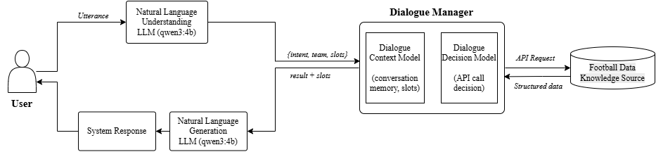

# football-dialogue-agent
LLM-powered football assistant that performs structured information extraction and real-time API integration for domain-specific question answering.

---

## Table of Contents
- [Architecture](#architecture)
- [Domain Schema](#domain-schema)
- [Tech Stack](#tech-stack)
- [Reproducibility Guide](#reproducibility-guide)
  - [Requirements](#requirements)
  - [Setup](#setup)
  - [Running the Agent](#running-the-agent)
  - [Troubleshooting](#troubleshooting)

---

## Architecture
```
User Input → LLM (Structured Intent & Slot Extraction in JSON) → Slot-Based Routing → Football-Data API → Generated Response
.
```

---

## Domain Schema
**Intent:** `GetInfo`  
**Required slot:** `team`  
**Optional slot list:** one or more of the following:

| Slot | Description |
|---|---|
| `lastOpponent` | Who the team played last |
| `lastScore` | Score of the last match |
| `leaguePosition` | Current league standing |
| `manager` | Current manager/coach |
| `nextGameDate` | Date of the next fixture |
| `nextOpponent` | Opponent in the next fixture |
| `numGamesPlayed` | Total games played this season |
| `playingNow` | Whether the team is currently in a live match |
| `winLossRecord` | Wins, draws and losses this season |

---

## Tech Stack
- Python
- Ollama (local LLM inference)
- Football-Data REST API
- Requests library

---

## Reproducibility Guide

### Requirements
- Python 3.10+
- [Ollama](https://ollama.com/download) installed locally
- The following Python packages:
```bash
pip install ollama requests
```

Or install from `requirements.txt`:
```bash
pip install -r requirements.txt
```

---

### Setup

#### 1. Pull the required model
```bash
ollama pull qwen3:4b-instruct
```

#### 2. Add your API key
Open `football_dialogue_agent.ipynb` and replace the placeholder with your own key:
```python
FOOTBALL_DATA_API_KEY = "YOUR_API_KEY_HERE"
```

Get a free key at [football-data.org](https://www.football-data.org/).

#### 3. Configure your Ollama client
Open `football_dialogue_agent.ipynb` and find the client setup cell. Choose **one** of the options below depending on your situation:

**Option A - University of Glasgow VPN (recommended, faster)**  
Connect to the University of Glasgow VPN first, then use:
```python
client = ollama.Client(host='http://makatea.dcs.gla.ac.uk:11434')
```

This runs inference on university GPU hardware and is significantly faster.

**Option B - Local machine (no VPN required)**  
Make sure Ollama is running locally first:
```bash
ollama serve
```

Then use:
```python
client = ollama.Client(host='http://localhost:11434')
```

> **Note:** Running locally requires at least 12GB of RAM. Performance will be slower as inference runs on CPU.

---

### Running the Agent
Once the client is configured, run all cells in `football_dialogue_agent.ipynb` from top to bottom, then execute the final cell to start the dialogue agent.
```
ASSISTANT: Hi, how can I help you?
USER: 
```

Type your question and press Enter. Type `bye` or `thanks` to exit.

---

### Troubleshooting

| Error | Cause | Fix |
|---|---|---|
| `ConnectionError` | Ollama not running | Run `ollama serve` in a terminal |
| `model requires more system memory` | Not enough RAM | Use the VPN option or try `qwen3:1.7b` |
| `ResponseError 404` | Model not pulled | Run `ollama pull qwen3:4b-instruct` |
| JSON parse errors | Model output has `<think>` tags | Already handled in code automatically |
